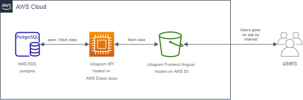
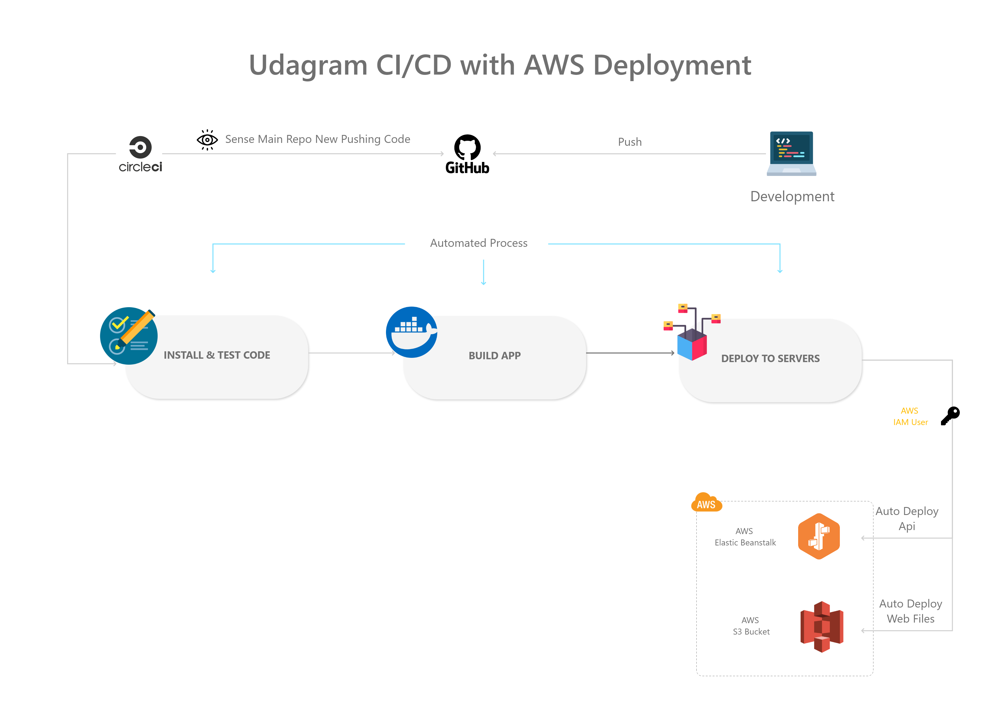

# Udagram [](link)

Udagram Full Stack Web Application connsist of 2 sub projects

1.  Udagram-frontend
2.  Udagram-api

## Udagram Infrastructres



As the pervious digrame there are 3 infrastructure

| Infrastructure       |       Perpose       |   Link |
| :------------------- | :-----------------: | -----: |
| AWS RDS              |     Hosting DB      | `link` |
| AWS ElasticBeanstalk | Hosting Backend API | `link` |
| AWS S3               |     Web Hosting     | `link` |

for more details you can read [Infrastructres Details](docs/Infrastructres.md)

## Pipeline Process


for more details you can read [Pipeline Process](docs/pipeline_process.md)

### Dependencies

```
- Node v14.15.1 (LTS) or more recent. While older versions can work it is advisable to keep node to latest LTS version

- npm 6.14.8 (LTS) or more recent, Yarn can work but was not tested for this project

- AWS CLI v2, v1 can work but was not tested for this project

- A RDS database running Postgres.

- A S3 bucket for hosting uploaded pictures.
```

## Getting Started

1. Clone this repo locally into the location of your choice.
2. follow the instructions in the installation step

## Installation

1- Install project dependencies

From the root folder:

- angluar/cli need to be installed first, for localy installation use

  `npm run dependencies:install`

  for globaly installation

  `npm install -g @angular/cli`

- installing main Frontend and Backend depenedacies

  `npm run frontend:install`

  `npm run frontend:install`

2- Export the ENV variables

`.env` file must be created under udagram-api path with the following content

| KEY               |          VALUE           |                               DESCRIPTION |
| :---------------- | :----------------------: | ----------------------------------------: |
| POSTGRES_USERNAME |        _DB-USER_         |                         Postgress DB User |
| POSTGRES_PASSWORD |      _DB-PASSWORD_       |                     Postgress DB Password |
| POSTGRES_DB       |        _DB-NAME_         |                         Postgress DB Name |
| PORT              |          _3000_          |                               Port Number |
| POSTGRES_HOST     |        _DB-HOST_         |               Postgress DB Host IP or URL |
| AWS_REGION        |       _aws_region_       |           AWS Region Name ex: `us-east-1` |
| AWS_PROFILE       |      _aws_profile_       |    AWS Profile name to host backend files |
| AWS_BUCKET        |       _aws_bucket_       | AWS S3 bucket name to host frontend files |
| URL               |          _url_           |                                       url |
| JWT_SECRET        | _I-am-JWT-Secret-String_ |                 Used to create JWT Tokens |

3- Testing Frontend and Backend

- `npm run frontend:test`

- `npm run frontend:test`

4- Building Frontend and Backend

- `npm run frontend:build`

- `npm run frontend:build`

5- Deploy Frontend and Backend

- `npm run frontend:deploy`

- `npm run frontend:deploy`

## Built With

- [Angular](https://angular.io/) - Single Page Application Framework
- [Node](https://nodejs.org) - Javascript Runtime
- [Express](https://expressjs.com/) - Javascript API Framework

## License

[License](LICENSE.txt)
