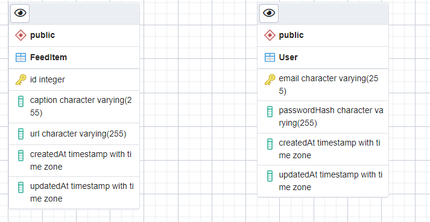

## Udagram Infrastructres

Pervious digrame discribe high level overview for Udagram infrastructures.

- **AWS RDS** used to host project database

  - Database Type: Postgres v
  - Host: `udagram-app.cmgb8ilh0484.us-east-1.rds.amazonaws.com`
  - User: `postgres`

  ### database ERD

  

- **AWS S3** used for web hosting

  - link: [udagram-web](http://udagram-web.s3-website-us-east-1.amazonaws.com/)

- **AWS ElasticBeanstalk** used for hosting backend api
  - link: [udagram-api](http://main-udagram-app.eba-4fpa4vv4.us-east-1.elasticbeanstalk.com/)
  - Node Version: 14
